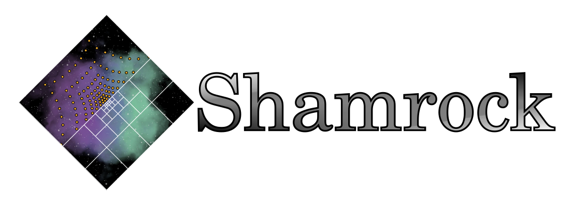

# Description

An general purpose code tu perform hydrodynamical simulations with various numerical methods.
This code is platform agnostic, meaning that it can run on a laptop up to a multi-GPU cluster

## Status
This code will be public when ready for production use
